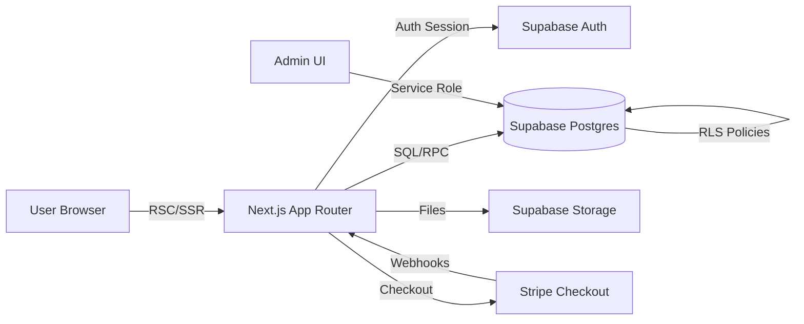
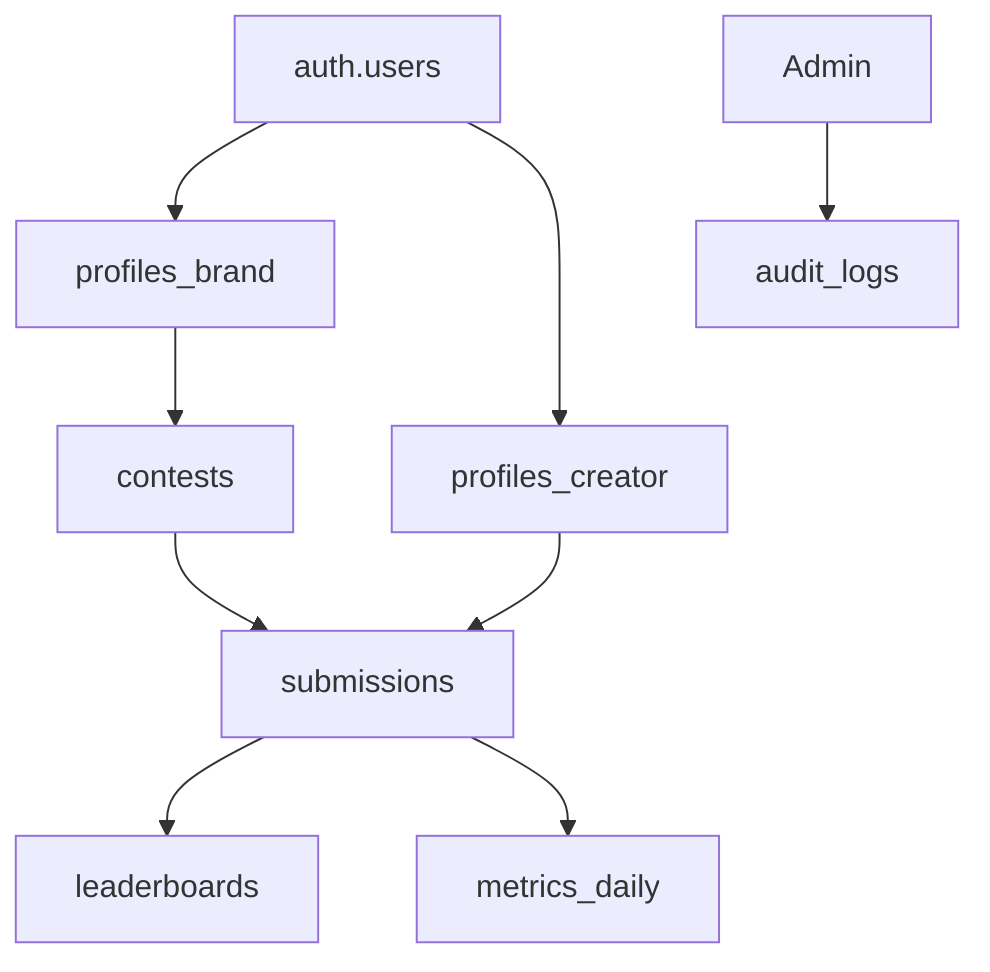

([Past chat][1])([Past chat][1])([Past chat][1])([Past chat][1])

# ClipRace — Project Master Document (PMD)

**Purpose:** Ce document est le *cerveau du projet* ClipRace. Il est conçu pour transférer le contexte total (produit, architecture, standards de code, décisions UX/UI, sécurité/perf) à un nouvel ingénieur IA Staff-level (ex: Claude 4.5 Sonnet) afin qu’il puisse contribuer **sans casser l’existant**, avec une qualité **prod-ready / finance-grade**.

> **Important (transparence)** : une partie de notre historique “conversationnel” détaillé n’est pas récupérable ici. Je consolide donc **toutes les décisions connues et stabilisées** (stack, architecture, vision produit, sécurité, design system, PRs) et je marque explicitement les **zones à confirmer** en *TODO/VERIFY* pour éviter toute hallucination et sécuriser la reprise.

---

## 0) TL;DR — Ce que ClipRace doit rester (non négociable)

* **Produit :** marketplace de concours UGC entre **Marques** et **Créateurs**, avec **soumissions**, **modération**, **classement**, **payout**.
* **Qualité :** standard **Finance-grade** : sécurité stricte, RBAC/RLS, audit, anti-abus, perf, a11y AA.
* **Stack :** **Next.js 16 App Router + React 19 + Tailwind v4 + Turbopack**, **Supabase** (Auth/RLS/Storage/RPC/Realtime), **Stripe** (Checkout + Connect Standard).
* **Design :** “Ink” (fond #050505), UI profonde, organique, signature visuelle “Race Light”, “Track Pattern”, “Clip Notch”.
* **Architecture front :** **Server Components par défaut**, client islands minimales, **no CLS**, skeletons parfaits.
* **Sécurité :** PR1 (CSRF edge-safe, rate limit, ownership checks) + RLS strict partout.
* **Roadmap immédiate :** **PR4 = Liste des concours** (côté Brand), pixel-close, robuste.

---

# 1) 🌍 VISION DU PRODUIT ET BUSINESS MODEL

## 1.1 Qu’est-ce que ClipRace ?

ClipRace est une plateforme SaaS qui connecte :

* **Marques** qui veulent générer du contenu (UGC) pour TikTok/Instagram/YouTube,
* **Créateurs** qui cherchent des opportunités rémunérées ou des produits,
  via un mécanisme standardisé de **concours** (brief + règles + période + récompenses + classement).

Objectif produit :

* **Simplifier** la création, collecte, modération, et mesure de performance UGC.
* **Rendre le ROI lisible** pour les marques (KPI, CPV, courbes de vues, attribution).
* **Fournir un earning path** clair pour les créateurs (portefeuille, cashout).

## 1.2 Comment ça marche (mécanique concours)

### Typologie de concours

1. **Cash Contest**

* La marque finance une cagnotte (via Stripe Checkout).
* Les créateurs soumettent des UGC (liens/URLs + métadonnées).
* Modération (pending → approved/rejected).
* Classement (vues/engagement), puis distribution des gains.

2. **Product Contest**

* La marque propose des produits.
* Les créateurs reçoivent/présentent le produit (logistique hors scope MVP ou “manual ops”).
* Soumission et modération identiques, mais reward non-cash (ou hybride).

### Cycle de vie (état de référence)

* **Draft** → **Ready for Payment** → **Live** → **Ended** → **Payout Ready** → **Paid/Archived**
* Soumissions : **pending** → **approved** / **rejected** (avec raison)

### Modération & anti-abus (MVP)

* Validation URL + rate limit + ownership checks.
* Marque modère; admin peut override (audit log).

## 1.3 Les 3 typologies d’utilisateurs

### 1) Marque (Brand)

* Crée et finance des concours.
* Gère brief, règles, dotations.
* Modère les soumissions.
* Visualise KPI & ROI.
* Télécharge factures, gère profil, méthode de paiement.

### 2) Créateur (Creator)

* Explore les concours.
* Participe et soumet du contenu.
* Suivi de participations.
* Portefeuille (gains), cashout via Stripe Connect (Standard).
* Profil public/privé, préférences.

### 3) Admin

* Supervision sécurité & conformité.
* Impersonation (mode “god” contrôlé).
* Modération escaladée.
* Bypass RLS **uniquement** via service/admin client, traçabilité obligatoire.

---

# 2) 🛠️ STACK TECHNIQUE ET INFRASTRUCTURE

## 2.1 Frontend

* **Next.js 16** (App Router)
* **React 19**
* **Tailwind CSS v4**
* **Turbopack**

Conventions clés :

* **RSC by default** (Server Components).
* Client components uniquement si besoin : state, effects, gestures.
* Chargements progressifs, Suspense, skeletons.

## 2.2 Backend/BaaS : Supabase

* **Auth** : login email/password + (TODO/VERIFY: magic link / OAuth)
* **PostgreSQL** : schéma structuré, contraintes, index
* **RLS** : strict, rôle-based
* **Storage** : assets UGC / médias (selon modèle)
* **Realtime** : PR0 mentionné (stabilisation) → usage pour events dashboards / moderation queue (TODO/VERIFY périmètre exact)
* **RPC** : fonctions SQL pour agrégations (leaderboards, metrics)

### Données (baseline confirmée)

Tables de référence :

* `users` (ou Supabase `auth.users` + mirror)
* `profiles_brand`
* `profiles_creator`
* `contests`
* `contest_terms`
* `payments_brand`
* `submissions`
* `metrics_daily`
* `leaderboards`
* `cashouts`
* `audit_logs`

> **Note** : Le design exact des colonnes est à relire dans les migrations Supabase (source de vérité).

## 2.3 Paiements : Stripe

### Paiement Brand (activation concours)

* **Stripe Checkout** : paiement “contest activation”.
* Webhooks : sécuriser état de paiement et transitions contest.

### Créateurs : Stripe Connect Standard

* Onboarding Connect (Standard) côté créateur.
* Cashout / payout orchestré via Stripe, avec statut local `cashouts`.
* **Commission plateforme : 15%** (standard ClipRace).

> **VERIFY** : modèle exact de fee (application fee / transfer / destination charge) selon Stripe Connect Standard choisi.

## 2.4 UI / Tooling

* **shadcn/ui** + **Radix**
* **Framer Motion**
* **Lenis** (scroll)
* `cva`, `clsx`
* Micro-interactions & “God-Mode UI” :

  * `@number-flow/react`
  * Sonner
  * cmdk
  * vaul
  * Rive WASM : `@rive-app/react-canvas` (**fix déjà fait**)
  * inspirations : Magic UI, Origin UI

---

# 3) 🛡️ SÉCURITÉ, PERF ET ARCHITECTURE (Finance-Grade)

## 3.1 Politique de rendu

* **Server Components par défaut**.
* **Client islands strictes** : isoler les hooks/animations aux composants nécessaires.
* **Data fetching** : côté serveur quand possible (RSC), cache/ISR selon pages (TODO/VERIFY stratégie exacte).

## 3.2 Sécurité (PR1 — hardening)

### CSRF Edge-safe

* CSRF tokens générés compatible Edge Runtime.
* Utiliser `crypto.getRandomValues` (pas `node:crypto`).
* Double-submit cookie / header pattern (TODO/VERIFY implémentation précise).
* Vérification systématique sur routes mutatives.

### Rate limiting

* Par IP (Vercel `x-forwarded-for` extraction robuste).
* Hashing du User-Agent (réduction contournement).
* Stratégie : sliding window / token bucket (TODO/VERIFY).
* Appliqué sur endpoints sensibles : auth, submit, payout, admin.

### Ownership checks

* Même si RLS est la base : **check ownership** au niveau API/route handler quand logique métier critique.
* Ne jamais “faire confiance” au client.

### RLS comme garde-fou principal

* Pas de données cross-tenant.
* Brand ne voit que ses contests/submissions.
* Creator ne voit que ses participations + contests publics.
* Admin via service role / admin client séparé.

## 3.3 Performance

* Préférence **CSS natif** > JS (ex : Beam via `@property`).
* Lazy loading : images, Rive, charts.
* **No CLS** :

  * skeleton loaders dimensionnés
  * placeholder heights fixes
  * images avec width/height
* Bundling : limiter libs lourdes côté client, dynamic import.

## 3.4 Accessibilité (WCAG AA)

* Radix primitives (focus management, aria).
* Contrastes “Ink”.
* Support strict de `prefers-reduced-motion` :

  * animations désactivables
  * Framer Motion conditionnel
* Navigation clavier : rail nav, dialogs, drawers, cmdk.

---

# 4) 🎨 VISION UX/UI ET DESIGN SYSTEM (Brand UI Kit)

## 4.1 Philosophie

* Niveau **Apple / Linear / Revolut** :

  * sobre, dense, premium
  * micro-interactions “expensives but controlled”
  * pas de “trucs gratuits” visuels qui nuisent à la perf

## 4.2 Palette & thème

* Thème **Ink**

  * fond principal : `#050505`
  * éviter les gris “délavés”
  * highlights : emerald glow subtil (“Race Light”)

## 4.3 Signatures visuelles

* **Race Light** : glow emerald contrôlé (jamais fluo)
* **Track Pattern** : texture de fond, faible contraste
* **Clip Notch** : coins biseautés / “clipped corners”
* **Glass / Beam** : GlassCard premium avec effet Beam **CSS-only** (no JS)

## 4.4 Motion (physique)

* Springs only :

  * vif : `stiffness: 300`, `damping: 30`
  * doux : `stiffness: 150`, `damping: 20`
* Interdiction du “ease-in-out” basique comme default.

## 4.5 Isolation CSS (PR2.2) : `.brand-scope`

Objectif : protéger le **global CSS Brand (850+ lignes)** contre :

* fuites sur Admin/Public
* conflits Turbopack + order CSS
* collisions de tokens/variables

Standard :

* Tout le Brand UI est encapsulé sous `.brand-scope`.
* Aucun style global non namespaced ne doit impacter le reste.

## 4.6 Composants clés (noyau)

* `BrandShell`
* `BrandProviders` (Sonner / Tooltip / Lenis)
* `GlassCard` (Beam CSS-only)
* `BrandInput`
* `KpiHero`
* `BrandRailNav` (navigation rétractable type Linear)
* `BrandTopBar`

> Règle : ces composants sont des “primitives maison”. On les réutilise, on ne les duplique pas.

---

# 5) 🗺️ CARTOGRAPHIE DES INTERFACES ET LOGIQUE (État Actuel)

> **Contexte sûr** : Brand UI Kit + Rail Nav + Dashboard refactor sont en place. Admin impersonation est prévue. PR4 vise la liste des concours.

## 5.1 Landing Page (Public)

* Pages : Accueil, Créateurs, Marques, FAQ/Contact (baseline produit)
* Objectif : conversion + compréhension rapide du mécanisme concours
* Tech : RSC, SEO propre, sections animées *discrètes* (prefers-reduced-motion)

**TODO/VERIFY**

* structure exacte des routes publiques (`/`, `/creators`, `/brands`, `/faq`, `/contact`)

## 5.2 Système d’authentification

* Routes auth dédiées (`/auth/...`)
* Guards :

  * redirection si non connecté vers login
  * redirection post-login vers workspace (brand/creator)
* RBAC :

  * rôle stocké en DB (profiles) + vérification server-side

**TODO/VERIFY**

* stratégie multi-profile (un user peut-il être brand + creator ?)
* méthode d’onboarding (steps) exacte

## 5.3 Interface Marque (Brand)

### Dashboard (refondu)

* Layout **Bento 12 colonnes**
* Modules : KPI hero, globe/trust module, liste/aperçu concours
* Navigation :

  * `BrandRailNav` rétractable (Linear-like)
  * top bar : actions, recherche, cmdk (si activé)

### Concours

* “Mes concours” (PR4)
* Création concours en **5 étapes** + paiement
* Détail concours : stats, UGC, classement, factures

**TODO/VERIFY**

* état exact de PR4 (page + composants déjà scaffold ?)
* niveau d’intégration metrics_daily / leaderboards dans l’UI

## 5.4 Interface Créateur (vision)

* Découvrir
* Détail concours
* Participer (soumission)
* Mes participations
* Portefeuille / cashout
* Profil

**Note**

* Le Creator UI doit rester cohérent avec Ink, mais peut avoir un scope différent (ex: `.creator-scope`) si nécessaire — à décider.

## 5.5 Interface Admin

* Impersonation des marques
* Bypass RLS via **admin client** (service role)
* Actions admin audit-loggées

**Standard**

* Toutes actions admin → `audit_logs` (qui, quoi, quand, pourquoi, cible)

---

# 6) ⚙️ ENVIRONNEMENT DE DEV ET CURSOR

## 6.1 Règles de contribution (IA / ingénieur)

**Objectif : ne pas casser.**

* Ne jamais refactor global sans nécessité.
* Respect absolu des primitives : `BrandShell`, `GlassCard`, etc.
* Pas de duplication de styles : utiliser les tokens/variants existants.
* Ajouter tests minimum sur les endpoints critiques.
* Chaque PR = petite surface + stable.

## 6.2 Docs indexées / références

* Magic UI (inspiration)
* Origin UI (inspiration)
* Tailwind v4 (référence)
* Supabase (Auth/RLS/Storage/RPC)
* Stripe (Checkout + Webhooks + Connect)
* shadcn/ui + Radix

## 6.3 Choix MCP / scraping / Rive

* Refus de Puppeteer (éviter copie bête / drift)
* UI construite “in-house” sur docs et inspirations
* Rive :

  * setup local **WASM** (pas CDN fragile)
  * `@rive-app/react-canvas` (résout issues d’intégration)

## 6.4 Standards repo (attendus)

* ESLint + Prettier + commitlint
* CI GitHub Actions
* Tests :

  * Unit : Vitest/RTL
  * E2E : Playwright
* Seed réaliste :

  * 5 marques
  * 30 créateurs
  * 3 concours
  * ~120 submissions

---

# 7) 🕰️ HISTORIQUE DES PRs (contexte d’évolution)

## PR0 — Realtime / Stabilisation

* Mise en place des bases temps réel (Supabase Realtime) + stabilisation structurelle.
* Convergence conventions (RSC by default, patterns data access).

## PR1 — Security Hardening

* CSRF edge-safe (crypto.getRandomValues)
* Rate limiting (IP `x-forwarded-for` + hash UA)
* Ownership checks + durcissement des routes mutatives
* RLS comme standard non contournable

## PR2 / PR2.1 / PR2.2 — Brand UI Kit & CSS Scope

* Thème Ink
* Composants Brand (Shell/Providers/GlassCard/Beam)
* Motion system “springs”
* `.brand-scope` (850+ lignes) pour isoler CSS et éviter fuites + conflits Turbopack

## PR3 — Nav Rail & Dashboard Refactor

* `BrandRailNav` (rétractable, style Linear)
* Dashboard Bento 12 cols (KPI / Trust module / etc.)
* Consolidation layout + top bar

## PR4 — Objectif actuel : Liste des concours

* Construire “Mes concours” (Brand) :

  * table/cards premium
  * filtres (status, type cash/product, date)
  * CTA create contest
  * états vides / loading / error
  * perf : pagination/virtualisation si nécessaire
  * intégration RLS + requêtes optimisées

---

# Annexes — Diagrammes (référence mentale)

## A) Architecture logique (haut niveau)

## B) Modèle de rôles (RBAC + RLS)

---

# “Operating Manual” — Instructions impératives pour l’IA Staff Engineer (Claude)

1. **Source de vérité = migrations + RLS + code existant.** Ne jamais inventer une colonne ou policy.
2. **Ne pas casser `.brand-scope`.** Tout ajout Brand doit rester encapsulé.
3. **Sécurité avant features.** Toute route mutative : CSRF + rate limit + ownership + RLS.
4. **Perf “no CLS”.** Chaque UI state (loading/empty/error) doit être designé.
5. **Motion = springs.** Respect `prefers-reduced-motion`.
6. **Stripe :** toujours “state machine” pilotée par webhook, jamais “trust client”.
7. **Admin :** service role séparé + audit log obligatoire.
8. **PR4 :** implémenter la liste concours de manière incrémentale, tests minimal, instrumentation.

---

## TODO/VERIFY (liste courte, critique, à traiter dès ouverture du repo)

* Confirmer **routes** exactes (public/auth/brand/creator/admin).
* Confirmer schéma exact des tables/colonnes + index.
* Confirmer modèle Stripe exact (application_fee vs autres) + events webhook utilisés.
* Confirmer périmètre Realtime (où, pourquoi, quels channels).
* Confirmer état PR4 (ce qui est déjà codé vs spec).

---

Si tu veux, je peux aussi produire une version **“System Prompt prêt à coller”** (format compact + checklists + règles de contribution + conventions de code) dérivée de ce PMD, optimisée pour Claude 4.5 Sonnet (avec sections “Do/Don’t”, “Repository map”, “SQL/RLS invariants”, “UI invariants”).

[1]: https://chatgpt.com/c/698cea87-c3d4-8394-94c8-19cfab5e14d0 "Amélioration UX Interface Marque"
